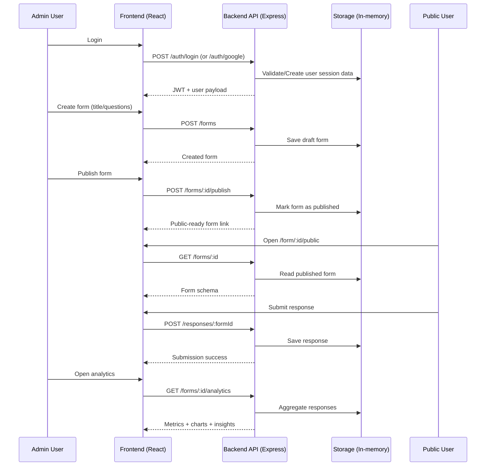
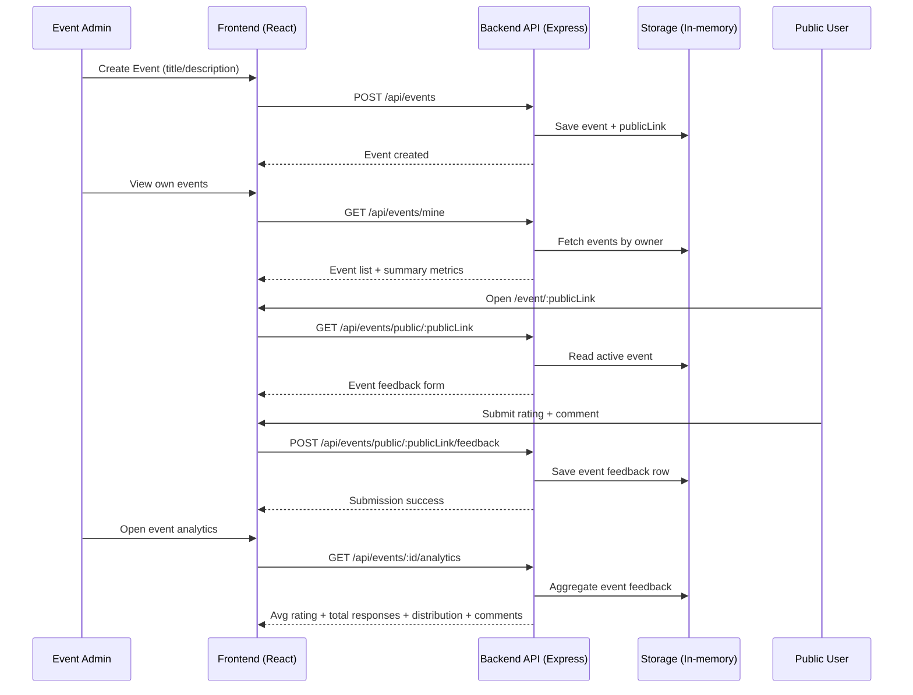

# LumaForms

LumaForms is a full-stack feedback platform for events and courses.
It includes:
- Auth (email/password + Google OAuth)
- Form builder with AI template generation
- Public response collection
- Interactive analytics dashboard
- Glossy glassmorphism UI

The default local workflow uses **in-memory storage** (no MongoDB required).

## About the Project

LumaForms is designed to help organizers collect structured feedback and turn responses into actionable insights quickly.
The product has two main experiences:

- Admin experience: create/publish forms, share links, and monitor analytics
- Public experience: submit feedback easily from a public link (anonymous or named)

This repo is optimized for local development and demos:
- Fast setup
- No database dependency in default mode
- Real API contracts and auth flow for production migration later

## System Architecture

### High-level architecture

```text
[React Frontend (Vite)]
        |
        | HTTP (REST)
        v
[Express API Layer]
  |     |       |
  |     |       +--> Auth routes (/auth)
  |     +----------> Form/Response routes (/forms, /responses)
  +----------------> Event routes (/api/events)

        |
        v
[Storage Layer]
  - In-memory store (default local mode)
  - Mongo-compatible models (optional future mode)
```

### Runtime request flow

1. Frontend sends request with optional JWT (`Authorization: Bearer ...`).
2. Express route validates auth/ownership and payload.
3. Business logic runs in route layer (`forms`, `responses`, `events`, `auth`).
4. Data is read/written to in-memory store (or Mongo model if configured).
5. API returns normalized response object to frontend.
6. UI renders cards/charts and interaction state from returned payload.

### Sequence diagram (end-to-end flow)



### Sequence diagram (event flow)



### Backend component map

- `backend/app.js`
  - App wiring, middleware registration, route mounting
- `backend/server.js`
  - Process startup, optional Mongo connection bootstrap
- `backend/middleware/`
  - `authMiddleware.js` for JWT gating
  - `requestLogger.js` for per-request logging
  - `errorHandler.js` for 404 + centralized error responses
- `backend/routes/`
  - `auth.js` auth endpoints
  - `forms.js` form lifecycle + analytics
  - `responses.js` public response intake
  - `eventRoutes.js` event-centric flow
- `backend/lib/inMemoryStore.js`
  - Default storage in local mode

### Frontend component map

- `frontend/src/App.jsx`
  - Route table and protected routes
- `frontend/src/pages/`
  - `Dashboard.jsx`, `FormBuilder.jsx`, `PublicForm.jsx`, `Analytics.jsx`
  - Event pages (`EventAdminDashboard.jsx`, `EventPublicFeedback.jsx`, etc.)
- `frontend/src/api.js`
  - Axios instance + auth header interceptor
- `frontend/src/index.css`
  - Glass palette, typography, tokens, accessibility focus styles

## 1) Prerequisites

Install:
- Node.js 18+ (recommended 20+)
- npm 9+

Optional:
- Google Cloud project (for Google login)

## 2) Project Structure

```text
feedback-forms/
  backend/
    lib/
    middleware/
    models/
    routes/
    server.js
  frontend/
    src/
      pages/
      auth/
      App.jsx
      index.css
    index.html
  README.md
```

## 3) Environment Setup (Step by Step)

### 3.1 Backend env

Create `backend/.env`:

```env
PORT=5000
JWT_SECRET=replace-with-a-strong-random-secret
GOOGLE_CLIENT_ID=your-google-client-id.apps.googleusercontent.com
```

Notes:
- Leave `MONGO_URI` empty to run local in-memory mode.
- In-memory mode means data resets when backend restarts.

### 3.2 Frontend env

Create `frontend/.env`:

```env
VITE_API_BASE_URL=http://127.0.0.1:5000
VITE_GOOGLE_CLIENT_ID=your-google-client-id.apps.googleusercontent.com
```

Important:
- `VITE_` prefix is required for frontend env values.
- Restart Vite server after editing env files.

### 3.3 Credentials to Run Normally

You have 2 ways to log in during development:

1. Demo login (quickest)
- Email: `demo@chiac.local`
- Password: `Demo@123`

2. Normal user login
- Open `/register`
- Create your own email/password account
- Then log in from `/login`

Google login:
- Requires valid Google OAuth client ID in both env files:
  - `backend/.env -> GOOGLE_CLIENT_ID`
  - `frontend/.env -> VITE_GOOGLE_CLIENT_ID`

Security note:
- Do not put real secrets in `*.env.example`.
- Keep real values only in local `backend/.env` and `frontend/.env` (these are git-ignored).

## 4) Run Locally (Step by Step)

### 4.1 Start backend

```bash
cd backend
npm install
npm run dev
```

Expected:
- Backend starts on `http://127.0.0.1:5000`

### 4.2 Start frontend

```bash
cd frontend
npm install
npm run dev
```

Expected:
- Frontend starts on `http://127.0.0.1:5173` (or Vite-selected port)

### 4.3 Open app

- Main app: `http://127.0.0.1:5173`
- Login page: `http://127.0.0.1:5173/login`

## 5) Google OAuth Setup (Step by Step)

1. Go to `https://console.cloud.google.com/`
2. Create/select a project
3. Configure OAuth consent screen
4. Create OAuth Client ID (Web application)
5. Add authorized JavaScript origins:
   - `http://localhost:5173`
   - `http://127.0.0.1:5173`
6. Copy Client ID
7. Set same value in:
   - `backend/.env -> GOOGLE_CLIENT_ID`
   - `frontend/.env -> VITE_GOOGLE_CLIENT_ID`
8. Restart backend + frontend

## 6) Core User Flows

### 6.1 Admin flow

1. Login
2. Open Dashboard (`/`)
3. Click `Create New Form`
4. In Form Builder:
   - Generate from AI prompt or add questions manually
   - Save draft
   - Publish form
5. Copy/share public link
6. Track responses in analytics

### 6.2 Public responder flow

1. Open public link: `/form/:id/public`
2. Choose anonymous or include-name mode
3. Answer questions
4. Submit response

### 6.3 Analytics flow

1. Open `/analytics/:id`
2. Use tabs:
   - Overview
   - Question Explorer
   - Text Insights
3. Review:
   - Total responses
   - Average rating
   - Rating distribution
   - Trend + sentiment insights

## 7) Routes Reference

### Frontend routes

- `/` Dashboard
- `/forms/create` Create form
- `/form/:id` Builder
- `/form/:id/public` Public form
- `/analytics/:id` Form analytics
- `/login` Login
- `/register` Register

Event routes:
- `/events/admin`
- `/events/feedback`
- `/event/:publicLink`
- `/events/analytics`

### Backend API routes

Auth:
- `POST /auth/register`
- `POST /auth/login`
- `POST /auth/google`

Forms:
- `POST /forms`
- `GET /forms`
- `GET /forms/:id`
- `PUT /forms/:id`
- `DELETE /forms/:id`
- `POST /forms/:id/publish`
- `POST /forms/generate-from-prompt`
- `GET /forms/:id/analytics`

Responses:
- `POST /responses/:formId`

Events:
- `POST /api/events`
- `GET /api/events/mine`
- `GET /api/events/public/:publicLink`
- `POST /api/events/public/:publicLink/feedback`
- `GET /api/events/:id/analytics`

## 8) Design System

Palette applied:
- Primary Blue: `#1E3A5F`
- Secondary Blue: `#87CEEB`
- Highlight Orange: `#FFA500`
- Positive Green: `#008080`
- Light Gray: `#F5F5F5`
- Off White: `#FAFAFA`

Guidelines used:
- High text contrast for readability (WCAG-focused)
- 2-3 dominant colors per screen
- Blue for trust, orange for energy, green for success

Main style file:
- `frontend/src/index.css`

## 9) Validation / QA Commands

Frontend:

```bash
cd frontend
npm run lint
npm run build
```

Backend quick route check:

```bash
node -e "require('./backend/routes/forms'); require('./backend/routes/auth'); console.log('ok')"
```

Backend integration tests:

```bash
cd backend
npm test
```

## 10) Troubleshooting

### Google button says disabled

- Ensure `frontend/.env` exists
- Ensure `VITE_GOOGLE_CLIENT_ID` is set
- Restart frontend dev server

### Google login fails on backend

- Ensure `GOOGLE_CLIENT_ID` in backend matches frontend client ID
- Ensure origin is allowed in Google Console

### Old UI still visible

- Confirm correct frontend port (`5173`)
- Hard refresh browser (`Ctrl + F5`)
- Restart frontend dev server

### Data disappeared

- Expected in in-memory mode after backend restart

### Security checks

- Run local secret scan:

```bash
git grep -nE "client_secret|JWT_SECRET=|mongodb\+srv|AIza|PRIVATE KEY|apps\.googleusercontent\.com"
```

- See `SECURITY.md` for leak-response and history cleanup commands.

## 11) Current Status

- Core form flow: implemented
- Public submission: implemented
- Interactive analytics: implemented
- Form deletion: implemented
- Google OAuth in active login flow: implemented
- Local in-memory mode: enabled by default
- Backend integration tests: enabled (`node --test`)
- Secret scanning guardrail: enabled via GitHub Action

## 12) License

MIT License. See `LICENSE`.
